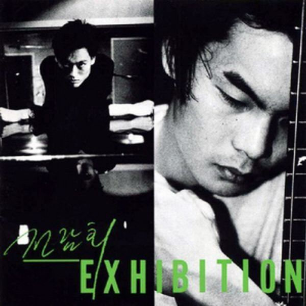

<!doctype html>
<html>
<head>
  <title>전람회-기억의 습작</title>
</head>

<body>
  <h1>기억의 습작</h1>
<iframe width="560" height="315" src="https://www.youtube.com/embed/EtXJHwX3ryU" title="YouTube video player" frameborder="0" allow="accelerometer; autoplay; clipboard-write; encrypted-media; gyroscope; picture-in-picture" allowfullscreen></iframe>
<ul>
  <li>아티스트 <a href="https://www.genie.co.kr/detail/artistInfo?xxnm=14940260l">전람회</a></li>
  <li>앨범명 <a href="https://www.genie.co.kr/detail/albumInfo?axnm=15034207"> Exhibition</a></li>
  <li>장르 가요/발라드</li>
  <li>재생시간 05:13</li>
  <li>작곡가 <a href="https://www.genie.co.kr/detail/artistInfo?xxnm=14945723">김동률</a></li>
</ul>

  

  <h2>가사</h2>
  이젠 버틸 순 없다고
  휑한 웃음으로
  내 어깨에 기대어
  눈을 감았지만

  이젠 말할 수 있는 걸
  너의 슬픈 눈빛이 나의 마음을
  아프게 하는 걸
  나에게 말해봐

  너의 마음 속으로
  들어가 볼 수만 있다면
  철없던 나의 모습이 얼만큼
  의미가 될 순 있는지

  많은 날이 지나고
  나의 마음 지쳐갈 때
  내 마음속으로
  쓰러져가는 너의 기억이
  다시 찾아와

  생각이 나겠지
  너무 커버린 미래의
  그 꿈들 속으로
  잊혀져 가는 너의 기억이
  다시 생각날까

  너의 마음 속으로
  들어가 볼 수만 있다면
  철없던 나의 모습이 얼만큼
  의미가 될 순 있는지

  많은 날이 지나고
  나의 마음 지쳐갈 때
  내 마음속으로
  쓰러져가는 너의 기억이
  다시 찾아와

  생각이 나겠지
  너무 커버린 내 미래의
  그 꿈들 속으로
  잊혀져 가는 나의 기억이
  다시 생각날까
  많은 날이 지나고

